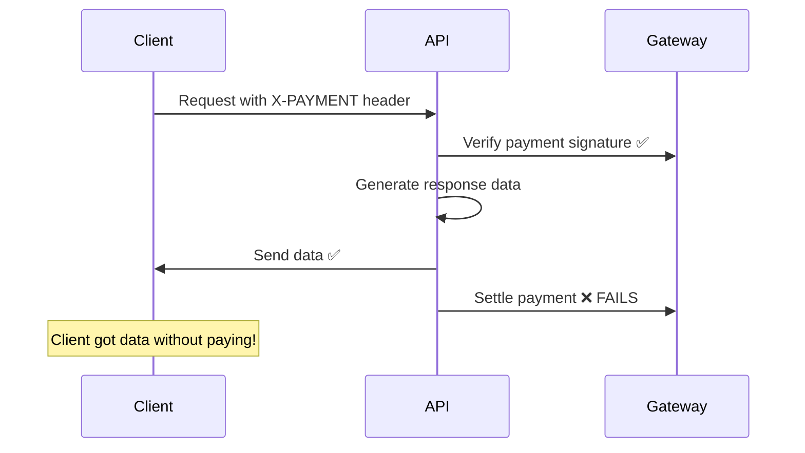
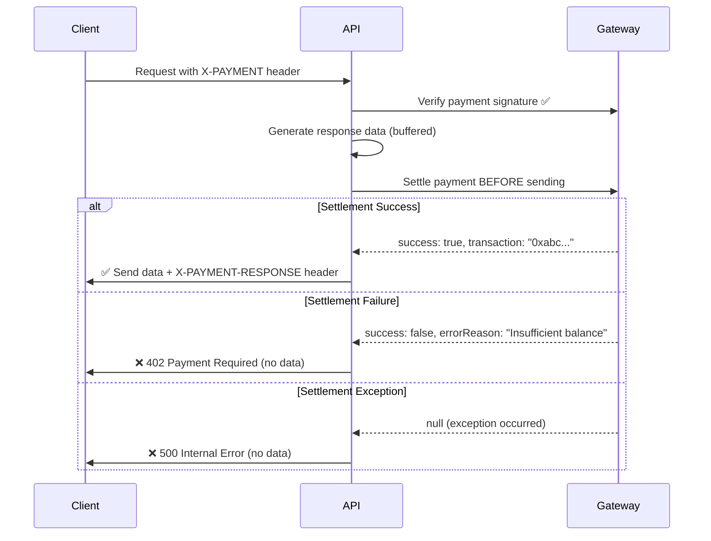

<Warning>
  **Critical Security Feature:** Settlement validation ensures clients **never**
  receive data if payment settlement fails, even when exceptions occur in the
  settlement process.
</Warning>

## The Problem

In early versions of payment-protected APIs, a critical security vulnerability existed:



**The issue:** If payment settlement failed (network error, insufficient balance, invalid signature, etc.), the client would still receive the data because the API had already sent the response.

---

## The Solution: Pre-Send Settlement Validation

Prism SDKs now **intercept the response before it's sent** and validate that settlement succeeded:



---

## How It Works by Framework

Each framework implements settlement validation using its native response interception mechanism:

### Express.js - `res.end()` Override

```javascript
// Intercept res.end() to perform settlement before sending
const originalEnd = res.end.bind(res);

res.end = async function (chunk, encoding, callback) {
  // Perform settlement BEFORE sending response
  const settlementResult = await core.settlementCallback(...);

  if (!settlementResult || !settlementResult.success) {
    // ❌ Settlement failed - send error instead of data
    res.status(402);
    return originalEnd(JSON.stringify({
      error: 'Payment settlement failed',
      details: settlementResult?.errorReason || 'Settlement processing failed'
    }));
  }

  // ✅ Settlement succeeded - send original data
  res.setHeader('X-PAYMENT-RESPONSE', settlementResult.transaction);
  return originalEnd(chunk, encoding, callback);
};
```

**Key Points:**

- Intercepts `res.end()` which is called by all Express response methods (`res.json()`, `res.send()`, etc.)
- Settlement happens **synchronously before** data is flushed to the client
- Original response data (`chunk`) is replaced with error JSON if settlement fails

---

### Fastify - `onSend` Hook

```javascript
// Use Fastify's onSend hook to intercept before sending
fastify.addHook('onSend', async (request, reply, payload) => {
  const settlementResult = await core.settlementCallback(...);

  if (!settlementResult || !settlementResult.success) {
    // ❌ Settlement failed - replace payload with error
    reply.code(402);
    reply.header('Content-Type', 'application/json');
    return JSON.stringify({
      error: 'Payment settlement failed',
      details: settlementResult?.errorReason || 'Settlement processing failed'
    });
  }

  // ✅ Settlement succeeded - add header and return original payload
  reply.header('X-PAYMENT-RESPONSE', settlementResult.transaction);
  return payload;
});
```

**Key Points:**

- `onSend` hook runs **after** route handler but **before** sending to client
- Can modify both status code and payload
- Returns new payload to replace original if settlement fails

---

### NestJS - Interceptor

```typescript
@Injectable()
export class SettlementInterceptor implements NestInterceptor {
  async intercept(context: ExecutionContext, next: CallHandler) {
    // Call route handler and get response
    const responseData = await firstValueFrom(next.handle());

    // Perform settlement
    const settlementResult = await this.core.settlementCallback(...);

    if (!settlementResult || !settlementResult.success) {
      // ❌ Settlement failed - throw exception (caught by filter)
      throw new HttpException({
        error: 'Payment settlement failed',
        details: settlementResult?.errorReason
      }, HttpStatus.PAYMENT_REQUIRED);
    }

    // ✅ Settlement succeeded - add header and return data
    const response = context.switchToHttp().getResponse();
    response.setHeader('X-PAYMENT-RESPONSE', settlementResult.transaction);
    return responseData;
  }
}
```

**Key Points:**

- Interceptor runs **after** route handler completes
- Can transform response or throw exceptions
- NestJS exception filters handle error responses

---

### Next.js - Response Wrapper

```typescript
export const withPrismPayment = (handler, config) => {
  return async (request: Request) => {
    // Call handler and get Response object
    const response = await handler(request);

    // Perform settlement
    const settlementResult = await core.settlementCallback(...);

    if (!settlementResult || !settlementResult.success) {
      // ❌ Settlement failed - return NEW Response (original is discarded)
      return new Response(JSON.stringify({
        error: 'Payment settlement failed',
        details: settlementResult?.errorReason
      }), {
        status: 402,
        headers: { 'Content-Type': 'application/json' }
      });
    }

    // ✅ Settlement succeeded - return original response
    return response;
  };
};
```

**Key Points:**

- Handler returns a `Response` object, not sent yet
- Can create a **new Response** to replace the original
- Original response is garbage collected if not returned

---

### Python (Flask) - `@app.after_request`

```python
@app.after_request
def settlement_validation(response):
    """Validate settlement before sending response"""

    settlement_result = g.get('prism_settlement_result')

    if not settlement_result or not settlement_result.get('success'):
        # ❌ Settlement failed - return error response instead
        error_reason = (settlement_result or {}).get('errorReason', 'Settlement processing failed')
        return jsonify({
            'error': 'Payment settlement failed',
            'details': error_reason
        }), 402

    # ✅ Settlement succeeded - add header and return original response
    response.headers['X-PAYMENT-RESPONSE'] = settlement_result['transaction']
    return response
```

**Key Points:**

- `@app.after_request` decorator runs **before** response is sent
- Can return a **different response** object
- Works with all Flask response types

---

### Python (FastAPI) - Middleware

```python
async def prism_middleware(request: Request, call_next):
    """Settlement validation middleware"""

    # Call route handler
    response = await call_next(request)

    # Perform settlement
    settlement_result = await core.settlement_callback(...)

    if not settlement_result or not settlement_result.get('success'):
        # ❌ Settlement failed - return error response
        error_reason = (settlement_result or {}).get('errorReason', 'Settlement processing failed')
        return JSONResponse(
            content={
                'error': 'Payment settlement failed',
                'details': error_reason
            },
            status_code=402
        )

    # ✅ Settlement succeeded - add header to response
    response.headers['X-PAYMENT-RESPONSE'] = settlement_result['transaction']
    return response
```

---

### Java (Servlet) - `HttpServletResponseWrapper`

```java
// Wrapper that captures output before sending
class ResponseWrapper extends HttpServletResponseWrapper {
    private ByteArrayOutputStream buffer = new ByteArrayOutputStream();
    private PrintWriter writer = new PrintWriter(buffer);

    @Override
    public PrintWriter getWriter() {
        return writer;
    }

    public byte[] getCapturedOutput() {
        writer.flush();
        return buffer.toByteArray();
    }
}

// In PrismFilter.doFilter()
ResponseWrapper wrapper = new ResponseWrapper(response);
chain.doFilter(request, wrapper);  // Execute servlet

// Now validate settlement BEFORE sending
String settlementHeader = core.getSettlementHeader(...);

if (settlementHeader == null) {
    // ❌ Settlement failed - send error instead of captured output
    response.setStatus(402);
    response.setContentType("application/json");
    response.getWriter().write("{\"error\":\"Payment settlement failed\"}");
} else {
    // ✅ Settlement succeeded - send captured output
    response.setHeader("X-PAYMENT-RESPONSE", settlementHeader);
    response.getOutputStream().write(wrapper.getCapturedOutput());
}
```

**Key Points:**

- Uses `HttpServletResponseWrapper` to **buffer** servlet output
- Servlet writes to wrapper, not real response
- After settlement, either send buffered data or error

---

## Settlement Validation States

The SDK handles **three possible states** from the settlement callback:

### ✅ Success (`success: true`)

```json
{
  "success": true,
  "transaction": "0xabc123...",
  "payer": "0x742d35Cc...",
  "network": "eth-sepolia"
}
```

**Action:** Send data with `X-PAYMENT-RESPONSE: 0xabc123...` header

---

### ❌ Failure (`success: false`)

```json
{
  "success": false,
  "errorReason": "Insufficient balance"
}
```

**Action:** Return 402 Payment Required:

```json
{
  "x402Version": 1,
  "error": "Payment settlement failed",
  "details": "Insufficient balance"
}
```

**Common failure reasons:**

- Insufficient balance in sender's account
- Invalid signature (replay attack, wrong nonce)
- Transfer authorization expired (`validBefore` passed)
- Network congestion (transaction timeout)
- Smart contract revert (token transfer failed)

---

### ⚠️ Exception (`null`)

```typescript
// Settlement callback returns null when exception occurs
return null;
```

**Action:** Return 402 or 500 error:

```json
{
  "x402Version": 1,
  "error": "Settlement processing error",
  "details": "An error occurred while settling the payment. Please try again."
}
```

**Common exception causes:**

- Network timeout to Gateway
- Gateway returned 5xx error
- Blockchain RPC node unavailable
- Invalid response format from Gateway

---

## Testing Settlement Validation

### Simulate Settlement Failure

To test that your API **blocks data** when settlement fails:

<Tabs>
  <Tab title="Mock Gateway Failure">
    ```javascript
    // Override settlement callback in tests
    jest.mock('@financedistrict/prism-x402-sdk', () => ({
      PrismMiddlewareCore: class {
        async settlementCallback() {
          return {
            success: false,
            errorReason: 'Insufficient balance'
          };
        }
      }
    }));

    // Test that data is blocked
    const response = await request(app)
      .get('/api/premium')
      .set('X-PAYMENT', mockPaymentHeader);

    expect(response.status).toBe(402);
    expect(response.body.error).toBe('Payment settlement failed');
    expect(response.body).not.toHaveProperty('data');  // ← No data leaked!
    ```

  </Tab>

  <Tab title="Network Timeout">
    ```javascript
    // Simulate Gateway timeout (returns null)
    jest.mock('@financedistrict/prism-x402-sdk', () => ({
      PrismMiddlewareCore: class {
        async settlementCallback() {
          return null;  // Exception occurred
        }
      }
    }));

    const response = await request(app)
      .get('/api/premium')
      .set('X-PAYMENT', mockPaymentHeader);

    expect(response.status).toBe(402);  // or 500 depending on framework
    expect(response.body).not.toHaveProperty('data');  // ← No data leaked!
    ```

  </Tab>
</Tabs>

---

### Verify No Data Leakage

**Always test these scenarios:**

1. **Settlement returns `success: false`**

   - Assert status is 402
   - Assert response body is error JSON (not data)
   - Assert no business logic data is in response

2. **Settlement returns `null`**

   - Assert status is 402 or 500
   - Assert response body is error JSON
   - Assert no data leaked

3. **Settlement throws exception**

   - Assert proper error handling
   - Assert no partial data sent

4. **Settlement timeout**
   - Assert request doesn't hang
   - Assert timeout error returned
   - Assert no data leaked

---

## Production Monitoring

Monitor settlement validation in production:

### Metrics to Track

```javascript
// Log settlement outcomes
if (!settlementResult) {
  logger.error("Settlement returned null", {
    route: req.path,
    timestamp: Date.now(),
    paymentHeader: req.headers["x-payment"]?.substring(0, 50),
  });
  metrics.increment("settlement.null");
}

if (settlementResult && !settlementResult.success) {
  logger.warn("Settlement failed", {
    route: req.path,
    reason: settlementResult.errorReason,
  });
  metrics.increment("settlement.failed", {
    reason: settlementResult.errorReason,
  });
}

if (settlementResult?.success) {
  metrics.increment("settlement.success");
  logger.info("Settlement succeeded", {
    transaction: settlementResult.transaction,
  });
}
```

### Alerts to Configure

- **High `settlement.null` rate** → Gateway connectivity issues
- **High `settlement.failed` rate** → Payment verification problems or user errors
- **Sudden drop in `settlement.success`** → Potential Gateway or blockchain issues

---

## Security Implications

<Warning>
  **Why This Matters:** Without settlement validation, your API becomes a
  **payment-optional system** where technical failures allow free access to paid
  content.
</Warning>

### Before Settlement Validation

```
User Experience:
1. Client sends invalid/expired payment
2. Gateway rejects settlement ❌
3. Client STILL gets data ✅ (bug!)
4. You lose revenue 💸

Attack Vector:
- Attacker sends expired signatures repeatedly
- Settlement fails every time
- Attacker gets data for free
- You have no recourse (payment never succeeded)
```

### After Settlement Validation

```
User Experience:
1. Client sends invalid/expired payment
2. Gateway rejects settlement ❌
3. Client gets 402 error (NO data)
4. Client must retry with valid payment
5. Revenue protected 💰

Attack Vector: CLOSED
- Invalid payments return 402
- No data leaked
- Attacker must pay to get data
```

---

## Migration Guide

If you're upgrading from an older version without settlement validation:

<Steps>
  <Step title="Update SDK packages">
    ```bash
    npm install @financedistrict/prism-x402-sdk-express@latest
    # or
    pip install --upgrade prism-flask
    ```
  </Step>

{" "}
<Step title="No code changes required">
  Settlement validation is **automatic** in all framework packages. Simply
  updating the package enables the security feature.
</Step>

{" "}
<Step title="Test settlement failures">
  Add tests to verify data is blocked when settlement fails (see Testing section
  above).
</Step>

  <Step title="Monitor settlement metrics">
    Add logging and metrics to track settlement outcomes in production.
  </Step>
</Steps>

---

## FAQ

<AccordionGroup>
  <Accordion title="Does settlement validation slow down responses?">
    **No.** Settlement happens **after** your route handler completes but **before** the response is sent to the client. The total request time is unchanged (settlement was always happening, just in the wrong order).
    
    The only difference is that the client waits for settlement to complete before receiving data, which is the correct behavior for a payment system.
  </Accordion>

{" "}
<Accordion title="What if the Gateway is down during settlement?">
  If the Gateway is unavailable, `settlementCallback()` returns `null` and the
  client receives a 402 or 500 error. **No data is sent.** This is the correct
  behavior - if we can't verify payment settlement, we should not provide data.
  The client can retry when the Gateway is back online.
</Accordion>

{" "}
<Accordion title="Can I disable settlement validation?">
  **No.** Settlement validation is a core security feature and cannot be
  disabled. If you need to test without settlement, use the SDK's **test mode**
  which accepts mock payments and performs mock settlement.
</Accordion>

{" "}
<Accordion title="What about async/background responses?">
  Settlement validation works with **synchronous responses** where the API
  generates and sends data immediately. For **async patterns** (webhooks,
  streaming, long-polling), you must handle settlement yourself: 1. Call
  `settlementCallback()` explicitly 2. Check result before sending data 3. Block
  data if settlement fails Most payment use cases are synchronous (API request →
  immediate response).
</Accordion>

  <Accordion title="Does this work with HTTP 304 Not Modified?">
    **Yes.** Settlement validation only runs when `statusCode < 400`, so 304 responses skip settlement (as they should - no new data was provided).
    
    Similarly, 404, 500, and other error responses skip settlement.
  </Accordion>
</AccordionGroup>

---

## Next Steps

<CardGroup cols={2}>
  <Card title="Payment Flow" icon="arrow-right" href="/concepts/payment-flow">
    Understand the complete payment verification and settlement process
  </Card>

  <Card
    title="Error Handling"
    icon="triangle-exclamation"
    href="/concepts/error-handling"
  >
    Learn how to handle payment and settlement errors gracefully
  </Card>

  <Card title="Testing Guide" icon="flask" href="/guides/testing">
    Test payment flows and settlement failures locally
  </Card>

  <Card
    title="Security Best Practices"
    icon="shield"
    href="/guides/security-best-practices"
  >
    Production security checklist for payment-protected APIs
  </Card>
</CardGroup>
