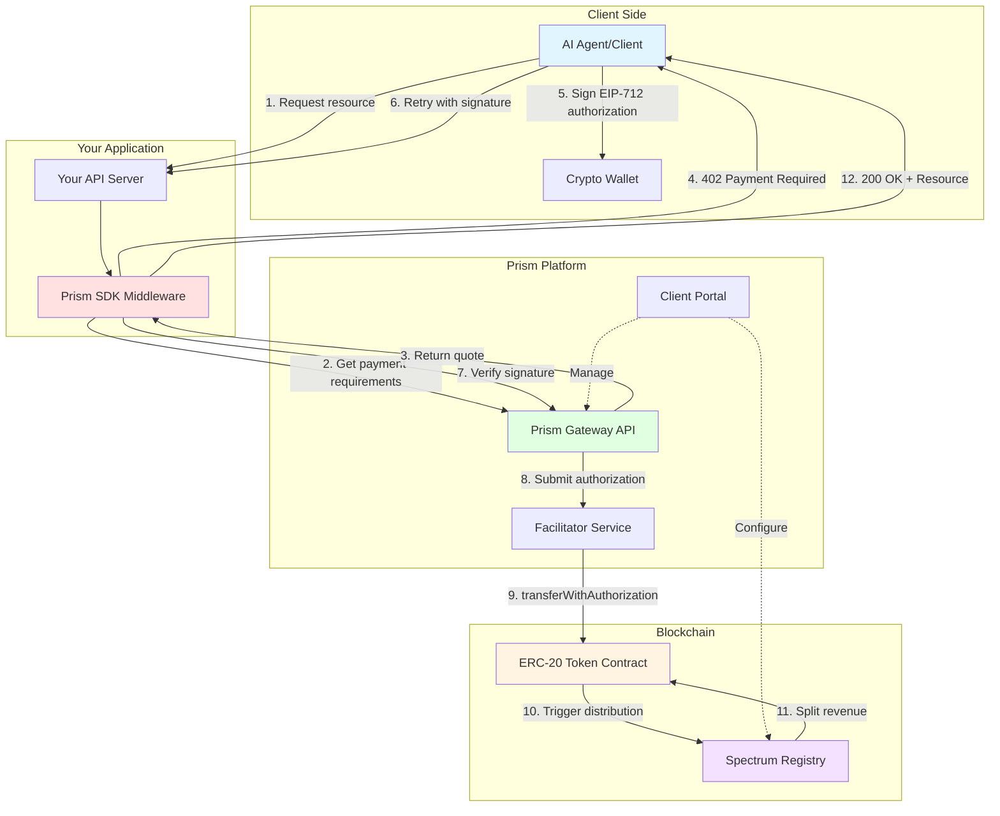
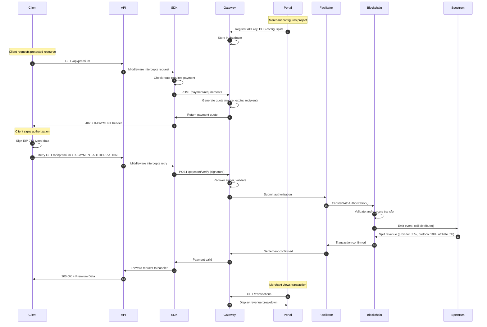

## Prism in One Sentence

**Prism is a payment gateway that enables micropayments for digital resources (API calls, content, AI agent services) using x402 HTTP protocol and blockchain settlement with EIP-3009 style transfer authorizations.**

## Architecture Diagram



## Component Deep Dive

### 1. Prism Gateway (Backend Service)

**Purpose:** Central orchestration layer for payment lifecycle

<Tabs>
  <Tab title="Responsibilities">
    - **Payment Requirements Generation** - Calculate pricing based on POS
    configuration - Generate unique nonces - Set expiry timestamps
    (validAfter/validBefore) - Return payment quote with recipient address -
    **API Key Management** - Validate API keys on each request - Enforce rate
    limits - Track API key scopes and permissions - **Signature Verification** -
    Recover signer from EIP-712 signature - Validate nonce hasn't been used -
    Check expiry timestamps - Verify amount and recipient match quote -
    **Settlement Orchestration** - Submit signed authorization to Facilitator -
    Monitor transaction confirmation - Update payment status in database -
    Trigger Spectrum distribution
  </Tab>

<Tab title="Endpoints">
  **Authentication** ``` GET /api/v1/auth-info ``` Returns API key details and
  capabilities **Payment Lifecycle** ``` POST /api/v1/payment/requirements POST
  /api/v1/payment/verify POST /api/v1/payment/settle ``` **Network Info** ```
  GET /api/v1/supported-networks GET /api/v1/supported-tokens ```
</Tab>

  <Tab title="Environments">
    **Sandbox (Testnet)** - URL: `https://prism-gw.test.1stdigital.tech` -
    Networks: base-sepolia, ethereum-sepolia, bsc-testnet - Tokens: Test USDC,
    AITC, FDUSD - API Key: `dev-key-123` (shared test key) - Faucet: Available
    for free test tokens **Production (Mainnet)** - URL:
    `https://prism-api.1stdigital.tech` - Networks: base, ethereum, bsc -
    Tokens: Real USDC, AITC, FDUSD - API Key: Unique per merchant (generate in
    Client Portal) - Costs: Real cryptocurrency + gas fees
  </Tab>
</Tabs>

### 2. Prism SDK (Client Libraries)

**Purpose:** Abstract Gateway complexity into simple middleware

<AccordionGroup>
  <Accordion icon="js" title="TypeScript/Node.js SDK">
    **Status:** ✅ Production Ready
    
    **Package:** `@financedistrict/prism-x402-sdk-express`
    
    **What it does:**
    1. **Request Interception** - Middleware intercepts all HTTP requests
    2. **Route Matching** - Checks if requested path requires payment
    3. **Payment Requirements** - Calls Gateway for payment quote
    4. **402 Response** - Returns X-PAYMENT header with payment options
    5. **Header Parsing** - Extracts X-PAYMENT-AUTHORIZATION from retry request
    6. **Signature Verification** - Validates signature through Gateway
    7. **Request Forwarding** - Passes valid requests to route handler
    8. **Error Handling** - Returns 401/402 for invalid/missing payments
    
    **Configuration:**
    ```typescript
    {
      apiKey: string;              // Your API key
      baseUrl?: string;            // Gateway URL (defaults to test)
      timeout?: number;            // Request timeout (ms)
      retries?: number;            // Failed request retries
    }
    ```
    
    **Route Config:**
    ```typescript
    {
      '/api/premium': {
        price: 0.001,              // Price per call
        description: string;       // Human-readable description
        mode?: 'single' | 'batch'; // Payment mode
      }
    }
    ```
  </Accordion>
  
  <Accordion icon="microsoft" title="C# / ASP.NET Core SDK">
    **Status:** 🔜 Q4 2025
    
    **Package:** `Prism.AspNetCore` (planned)
    
    **Planned Features:**
    - ASP.NET Core middleware
    - Attribute-based routing (`[RequirePayment(0.001)]`)
    - Async/await support
    - Dependency injection integration
    - ILogger integration
    - Health check endpoints
    
    **Expected Usage:**
    ```csharp
    services.AddPrism(options => {
        options.ApiKey = Configuration["Prism:ApiKey"];
        options.UseSandbox = true;
    });
    
    [RequirePayment(0.001, Description = "Premium API")]
    public IActionResult GetPremiumData() { }
    ```
  </Accordion>
  
  <Accordion icon="python" title="Python (Flask/FastAPI) SDK">
    **Status:** 🔜 Q1 2026
    
    **Package:** `prism-flask` / `prism-fastapi` (planned)
    
    **Planned Features:**
    - Flask decorator support
    - FastAPI dependency injection
    - Async support (FastAPI)
    - Type hints
    - Pydantic models
    
    **Expected Usage (Flask):**
    ```python
    from prism_flask import require_payment
    
    @app.route('/api/premium')
    @require_payment(price=0.001, description="Premium API")
    def premium_data():
        return {"data": "premium"}
    ```
    
    **Expected Usage (FastAPI):**
    ```python
    from prism_fastapi import PrismMiddleware, PaymentRequired
    
    app.add_middleware(PrismMiddleware, api_key=settings.prism_key)
    
    @app.get("/api/premium")
    async def premium_data(
        payment: PaymentRequired = Depends(verify_payment(0.001))
    ):
        return {"data": "premium"}
    ```
  </Accordion>
</AccordionGroup>

**Why SDK is Essential:**

<Tabs>
  <Tab title="With SDK">
    ```typescript
    // 10 lines of code
    import { prismPaymentMiddleware } from '@financedistrict/prism-x402-sdk-express';
    
    app.use(
      prismPaymentMiddleware(
        { apiKey: 'key' },
        { '/api/premium': { price: 0.001 } }
      )
    );
    
    app.get('/api/premium', (req, res) => {
      res.json({ data: 'premium' });
    });
    ```
  </Tab>
  
  <Tab title="Without SDK">
    ```typescript
    // 200+ lines of code
    import axios from 'axios';
    import { recoverTypedSignature } from '@metamask/eth-sig-util';
    
    app.get('/api/premium', async (req, res) => {
      // 1. Check if route requires payment
      const routeConfig = findRouteConfig(req.path);
      if (!routeConfig) return next();
      
      // 2. Check for payment authorization header
      const authHeader = req.headers['x-payment-authorization'];
      
      if (!authHeader) {
        // 3. Call Gateway for payment requirements
        const quote = await axios.post(
          'https://prism-gw.test.1stdigital.tech/api/v1/payment/requirements',
          {
            amount: routeConfig.price,
            resource: req.path
          },
          {
            headers: { 'x-api-key': process.env.PRISM_API_KEY }
          }
        );
        
        // 4. Build EIP-712 typed data
        const typedData = {
          types: {
            EIP712Domain: [/* ... */],
            TransferWithAuthorization: [/* ... */]
          },
          domain: {/* ... */},
          primaryType: 'TransferWithAuthorization',
          message: {
            from: req.headers['x-payment-from'],
            to: quote.data.recipient,
            value: quote.data.amount,
            validAfter: quote.data.validAfter,
            validBefore: quote.data.validBefore,
            nonce: quote.data.nonce
          }
        };
        
        // 5. Return 402 with X-PAYMENT header
        res.status(402).set({
          'X-PAYMENT': JSON.stringify({
            version: 1,
            type: 'eip3009',
            networks: [/* ... */],
            typedData
          })
        }).json({ error: 'Payment required' });
        return;
      }
      
      // 6. Parse authorization header
      const { signature, from, nonce } = JSON.parse(authHeader);
      
      // 7. Recover signer
      const signer = recoverTypedSignature({/* ... */});
      
      // 8. Verify signature through Gateway
      const verification = await axios.post(
        'https://prism-gw.test.1stdigital.tech/api/v1/payment/verify',
        { signature, from, nonce },
        { headers: { 'x-api-key': process.env.PRISM_API_KEY } }
      );
      
      if (!verification.data.valid) {
        return res.status(401).json({ error: 'Invalid payment' });
      }
      
      // 9. Settle payment
      await axios.post(
        'https://prism-gw.test.1stdigital.tech/api/v1/payment/settle',
        { nonce },
        { headers: { 'x-api-key': process.env.PRISM_API_KEY } }
      );
      
      // 10. Finally return resource
      res.json({ data: 'premium' });
    });
    ```
    
    **And you still need to:**
    - Implement retry logic
    - Handle timeouts
    - Cache payment requirements
    - Track nonce usage
    - Handle network errors
    - Validate expiry timestamps
    - Match route patterns (wildcards, params)
    - Parse EIP-712 domain separator
    - Implement replay attack prevention
  </Tab>
</Tabs>

### 3. Facilitator (Settlement Relay)

**Purpose:** Gas sponsor for gasless user transactions

<Steps>
  <Step title="Receive Authorization">
    Prism Gateway sends signed EIP-3009 authorization:
    ```json
    {
      "from": "0xAgent...",
      "to": "0xProvider...",
      "value": "1000000",
      "validAfter": 0,
      "validBefore": 1735689600,
      "nonce": "0x1234...",
      "v": 28,
      "r": "0xabcd...",
      "s": "0xef01..."
    }
    ```
  </Step>
  
  <Step title="Validate Authorization">
    **Signature Validation:**
    - Recover signer using `ecrecover(hash, v, r, s)`
    - Verify `signer == from address`
    
    **Business Logic Checks:**
    - `block.timestamp >= validAfter`
    - `block.timestamp <= validBefore`
    - `nonceUsed[from][nonce] == false`
    - `balanceOf[from] >= value`
  </Step>
  
  <Step title="Submit On-Chain">
    Facilitator wallet submits transaction:
    ```solidity
    function transferWithAuthorization(
        address from,
        address to,
        uint256 value,
        uint256 validAfter,
        uint256 validBefore,
        bytes32 nonce,
        uint8 v,
        bytes32 r,
        bytes32 s
    ) external {
        // Token contract validates and executes
    }
    ```
    
    **Gas paid by:** Facilitator wallet (not user)
  </Step>
  
  <Step title="Spectrum Distribution">
    Token contract emits event:
    ```solidity
    event TransferWithAuthorization(
        address indexed from,
        address indexed to,
        uint256 value,
        bytes32 indexed nonce
    );
    ```
    
    Spectrum Registry listens and triggers revenue split
  </Step>
</Steps>

**Why Facilitator Exists:**

<CardGroup cols={2}>
  <Card title="User Experience" icon="user">
    Users don't need native tokens (ETH, BNB) - just USDC/AITC/FDUSD
  </Card>

<Card title="Gasless Payments" icon="gas-pump">
  Facilitator pays gas, deducts fee from payment amount
</Card>

<Card title="MEV Protection" icon="shield">
  Can use private mempool to prevent front-running
</Card>

  <Card title="Batch Processing" icon="layer-group">
    Can batch multiple authorizations in single transaction
  </Card>
</CardGroup>

### 4. Spectrum Registry (On-Chain Distribution)

**Purpose:** Automated revenue splitting on settlement

<Tabs>
  <Tab title="Configuration">
    **Revenue Split Example:**
    ```json
    {
      "projectId": "proj_123",
      "splits": [
        {
          "recipient": "0xProvider...",
          "percentage": 8500,  // 85%
          "label": "Provider"
        },
        {
          "recipient": "0xProtocol...",
          "percentage": 1000,  // 10%
          "label": "Protocol Fee"
        },
        {
          "recipient": "0xAffiliate...",
          "percentage": 500,   // 5%
          "label": "Affiliate Commission"
        }
      ]
    }
    ```
    
    **Configured in:** Prism Client Portal
  </Tab>
  
  <Tab title="Smart Contract">
    ```solidity
    contract SpectrumRegistry {
        struct Split {
            address recipient;
            uint16 percentage; // basis points (10000 = 100%)
        }
        
        mapping(bytes32 => Split[]) public projectSplits;
        
        function distribute(
            bytes32 projectId,
            address token,
            uint256 amount
        ) external {
            Split[] memory splits = projectSplits[projectId];
            
            for (uint i = 0; i < splits.length; i++) {
                uint256 splitAmount = (amount * splits[i].percentage) / 10000;
                IERC20(token).transfer(splits[i].recipient, splitAmount);
            }
            
            emit DistributionComplete(projectId, amount);
        }
    }
    ```
  </Tab>
  
  <Tab title="Execution Flow">
    ```mermaid
    sequenceDiagram
        participant Token as ERC-20 Token
        participant Spectrum as Spectrum Registry
        participant Provider
        participant Protocol
        participant Affiliate
        
        Token->>Token: transferWithAuthorization executed
        Token->>Spectrum: Call distribute(projectId, amount)
        Spectrum->>Provider: Transfer 0.85 USDC (85%)
        Spectrum->>Protocol: Transfer 0.10 USDC (10%)
        Spectrum->>Affiliate: Transfer 0.05 USDC (5%)
        Spectrum->>Token: Emit DistributionComplete
    ```
  </Tab>
</Tabs>

### 5. Prism Client Portal (Admin UI)

**Purpose:** Merchant dashboard for configuration and monitoring

**URL:** https://prism.1stdigital.tech

<Tabs>
  <Tab title="Project Management">
    **Create and configure projects:**
    - Organization name
    - Logo and branding
    - Default currency (USDC, AITC, FDUSD)
    - Supported networks (Base, Ethereum, BSC)
    - Contact information
    
    **Project Settings:**
    - Webhook URLs for payment notifications
    - Rate limits (requests per minute)
    - IP whitelisting
    - CORS configuration
  </Tab>
  
  <Tab title="API Keys">
    **Generate and manage API keys:**
    - Create new keys with custom names
    - Set expiration dates
    - Scope permissions:
      - `payment:read` - Read payment info
      - `payment:verify` - Verify signatures
      - `payment:settle` - Initiate settlements
    - View key usage statistics
    - Rotate keys securely
    - Revoke compromised keys
    
    **Best Practices:**
    - Use different keys for dev/prod
    - Rotate keys every 90 days
    - Store in environment variables
    - Never commit to git
  </Tab>
  
  <Tab title="Wallet Configuration">
    **Configure wallet addresses:**
    
    **Provider Wallet** (receives payments)
    - Your wallet that receives customer payments
    - Should be hot wallet for automatic settlements
    - Recommend multi-sig for production
    
    **Facilitator Wallet** (pays gas)
    - Funded by Prism (or self-hosted)
    - Needs native tokens (ETH, BNB) for gas
    - Automatically refilled by platform
    
    **Cold Storage Wallet** (withdrawal destination)
    - Offline wallet for storing accumulated funds
    - Configure auto-withdrawal thresholds
    - Multi-sig recommended
  </Tab>
  
  <Tab title="POS Configuration">
    **Define resources and pricing:**
    
    ```json
    {
      "resources": [
        {
          "path": "/api/premium",
          "method": "GET",
          "price": 0.001,
          "currency": "USDC",
          "description": "Premium API access",
          "rateLimit": 100
        },
        {
          "path": "/api/ai-inference",
          "method": "POST",
          "price": 0.01,
          "currency": "AITC",
          "description": "AI model inference",
          "mode": "batch",
          "batchSize": 100
        }
      ]
    }
    ```
    
    **Dynamic Pricing:**
    - Set time-based pricing (peak hours)
    - Volume discounts
    - Currency conversion rates
  </Tab>
  
  <Tab title="Revenue Splits">
    **Configure Spectrum distribution:**
    
    - Drag-and-drop split configuration
    - Visual percentage calculator
    - Multi-stakeholder support
    - Affiliate tracking codes
    - Protocol fee adjustment (10% standard)
    
    **Split Rules:**
    - Minimum 1% per recipient
    - Total must equal 100%
    - Up to 10 recipients per project
    - Changes apply to new settlements only
  </Tab>
  
  <Tab title="Transaction Monitoring">
    **Real-time dashboard:**
    
    **Metrics:**
    - Total revenue (24h, 7d, 30d, all-time)
    - Payment success rate
    - Average payment amount
    - Top resources by revenue
    - Facilitator fees paid
    - Active sessions/subscriptions
    
    **Transaction Log:**
    - Timestamp
    - Resource
    - Amount
    - Token/Network
    - Status (pending, confirmed, failed)
    - Transaction hash (link to block explorer)
    - Facilitator fee
    - Spectrum split breakdown
    
    **Export Options:**
    - CSV download
    - JSON API export
    - Accounting software integration (QuickBooks, Xero)
  </Tab>
</Tabs>

## Data Flow (End-to-End)



## Security Model

<AccordionGroup>
  <Accordion icon="key" title="API Key Protection">
    **Storage:**
    - Environment variables (`.env` files)
    - Secret management systems (AWS Secrets Manager, Azure Key Vault)
    - Never hardcode in source code
    - Never commit to git (add `.env` to `.gitignore`)
    
    **Rotation:**
    - Rotate keys every 90 days
    - Use different keys for dev/staging/prod
    - Revoke old keys after rotation grace period
    
    **Scoping:**
    - Limit permissions to minimum required
    - Use read-only keys for monitoring
    - Separate keys for settlement operations
  </Accordion>
  
  <Accordion icon="signature" title="EIP-712 Signature Validation">
    **Domain Separator:**
    - Prevents cross-chain replay attacks
    - Includes chainId and contract address
    - Validated on-chain
    
    **Message Structure:**
    ```solidity
    struct TransferWithAuthorization {
        address from;
        address to;
        uint256 value;
        uint256 validAfter;
        uint256 validBefore;
        bytes32 nonce;
    }
    ```
    
    **Validation Steps:**
    1. Hash typed data using EIP-712 standard
    2. Recover signer: `ecrecover(hash, v, r, s)`
    3. Verify `signer == from address`
    4. Check nonce not used: `!nonceUsed[from][nonce]`
    5. Check expiry: `validAfter <= now <= validBefore`
    6. Check recipient: `to == expectedRecipient`
  </Accordion>
  
  <Accordion icon="fingerprint" title="Nonce Tracking (Replay Prevention)">
    **Nonce Generation:**
    - 32 random bytes (256 bits)
    - Generated by Gateway for each quote
    - Cryptographically secure random
    
    **On-Chain Storage:**
    ```solidity
    mapping(address => mapping(bytes32 => bool)) public nonceUsed;
    
    function transferWithAuthorization(...) external {
        require(!nonceUsed[from][nonce], "Nonce already used");
        nonceUsed[from][nonce] = true;
        // ... execute transfer
    }
    ```
    
    **Why This Works:**
    - Each authorization has unique nonce
    - Nonce can only be used once on-chain
    - Prevents double-spending
    - Prevents replay attacks
  </Accordion>
  
  <Accordion icon="clock" title="Expiry Validation (Time-Bound Quotes)">
    **Time Windows:**
    - `validAfter`: Earliest timestamp authorization can execute
    - `validBefore`: Latest timestamp authorization can execute
    - Typical window: 5-15 minutes
    
    **Why Two Timestamps?**
    - **validAfter**: Prevents premature execution (if price quote has delay)
    - **validBefore**: Prevents stale quotes (if price changes or front-running)
    
    **Example:**
    ```typescript
    {
      validAfter: Math.floor(Date.now() / 1000), // Now
      validBefore: Math.floor(Date.now() / 1000) + 900 // 15 minutes
    }
    ```
    
    **On-Chain Validation:**
    ```solidity
    require(block.timestamp >= validAfter, "Authorization not yet valid");
    require(block.timestamp <= validBefore, "Authorization expired");
    ```
  </Accordion>
  
  <Accordion icon="shield-check" title="Recipient Verification">
    **Signature Includes Recipient:**
    - Prevents payment redirect attacks
    - `to` address is part of signed message
    - On-chain validation ensures funds go to intended recipient
    
    **Attack Prevention:**
    Without recipient verification:
    1. Attacker intercepts signed authorization
    2. Changes `to` address to their own
    3. Submits modified authorization
    4. Steals payment
    
    With recipient verification:
    1. Attacker intercepts authorization
    2. Tries to change `to` address
    3. Signature no longer valid (hash doesn't match)
    4. Transaction reverts
  </Accordion>
  
  <Accordion icon="bolt" title="Front-Running Mitigation">
    **Problem:**
    - Attacker sees pending transaction in mempool
    - Submits same transaction with higher gas
    - Gets executed first (steals opportunity)
    
    **Mitigations:**
    
    **1. Private Mempool:**
    - Facilitator uses Flashbots/Eden/etc
    - Transaction not visible publicly
    - Executed directly by block builder
    
    **2. Time Windows:**
    - `validAfter` prevents immediate execution
    - Gives legitimate transaction time to confirm
    
    **3. Nonce Uniqueness:**
    - Even if front-run, second transaction reverts (nonce already used)
    - Original payer only pays once
    
    **4. Recipient Lock:**
    - Payment can only go to signed recipient
    - Front-runner can't redirect funds
  </Accordion>
</AccordionGroup>

## Deployment Patterns

<Tabs>
  <Tab title="Single Server">
    **Architecture:** ``` Internet → Load Balancer → App Server (SDK) → Prism
    Gateway ``` **Pros:** - Simple setup - Low infrastructure cost - Easy
    debugging **Cons:** - Single point of failure - Limited scalability - No
    geographic distribution **Best for:** - Development/testing - Small-scale
    production (&lt;100 req/s) - MVP/prototype
  </Tab>

{" "}

<Tab title="Multi-Region">
  **Architecture:** ``` Internet → CDN → Regional Load Balancers → App Servers →
  Prism Gateway ``` **Pros:** - High availability - Low latency
  (geo-distributed) - Horizontal scalability **Cons:** - Complex setup - Higher
  cost - State synchronization challenges **Best for:** - High-traffic
  production (>1000 req/s) - Global user base - Mission-critical services
</Tab>

{" "}

<Tab title="Microservices">
  **Architecture:** ``` Internet → API Gateway → [Auth Service, Payment Service,
  Resource Service] → Prism Gateway ``` **Pros:** - Service isolation -
  Independent scaling - Technology diversity **Cons:** - Complex orchestration -
  Higher operational overhead - Distributed tracing required **Best for:** -
  Large organizations - Complex business logic - Team autonomy
</Tab>

  <Tab title="Serverless">
    **Architecture:** ``` Internet → AWS Lambda/Azure Functions → Prism Gateway
    ``` **Pros:** - Auto-scaling - Pay-per-use - No server management **Cons:**
    - Cold start latency - Vendor lock-in - State management challenges **Best
    for:** - Sporadic traffic - Cost optimization - Event-driven workloads
  </Tab>
</Tabs>

## Monitoring & Observability

<CardGroup cols={2}>
  <Card title="Metrics to Track" icon="chart-line">
    - Payment success rate - 402 response time - Gateway API latency - Signature
    verification time - Settlement confirmation time - Error rates by type -
    Revenue per resource - Active payment sessions
  </Card>

{" "}
<Card title="Alerting Triggers" icon="bell">
  - Payment success rate &lt; 95% - Gateway API errors &gt; 5% - Signature
  verification failures spike - Settlement delays &gt; 5 minutes - API key
  approaching rate limit - Facilitator wallet low balance - Blockchain network
  congestion
</Card>

{" "}
<Card title="Logging Best Practices" icon="file-lines">
  - Log all payment attempts - Include request IDs for tracing - Never log API
  keys or signatures - Structured logging (JSON format) - Centralized log
  aggregation - Retention: 90 days minimum
</Card>

  <Card title="Tools Integration" icon="screwdriver-wrench">
    - **Metrics:** Prometheus, Datadog, New Relic - **Logging:** ELK Stack,
    Splunk, CloudWatch - **Tracing:** Jaeger, Zipkin, OpenTelemetry -
    **Alerts:** PagerDuty, Opsgenie, Slack
  </Card>
</CardGroup>

## Next Steps

<CardGroup cols={2}>
  <Card title="x402 Protocol" icon="bolt" href="/concepts/x402-protocol">
    Deep dive into HTTP 402 payment standard
  </Card>

<Card
  title="EIP-3009 Settlement"
  icon="ethereum"
  href="/concepts/eip3009-settlement"
>
  Understand gasless transfer authorizations
</Card>

<Card title="Payment Modes" icon="credit-card" href="/concepts/payment-modes">
  Compare single-call, batch, and subscription modes
</Card>

  <Card title="Quick Start" icon="rocket" href="/quickstart">
    Build your first integration in 5 minutes
  </Card>
</CardGroup>
