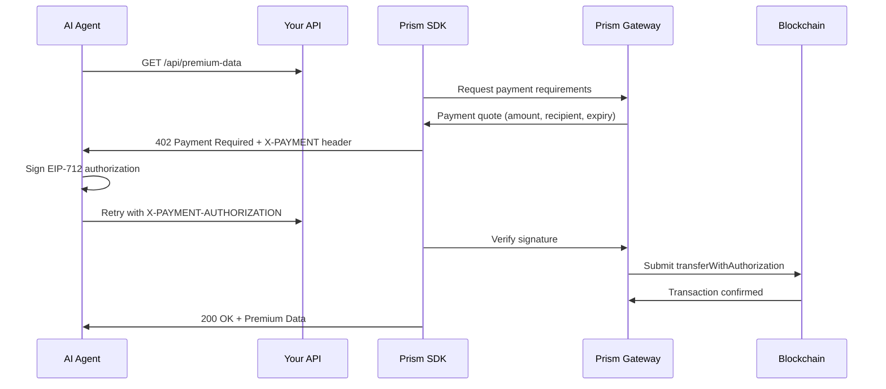

## What is Prism?

**Prism is a payment gateway that enables micropayments for digital resources** (API calls, content, AI agent services) using the **x402 HTTP protocol** and **blockchain settlement** with EIP-3009 style transfer authorizations.

<CardGroup cols={2}>
  <Card title="x402 Protocol" icon="bolt" href="/concepts/x402-protocol">
    HTTP 402 "Payment Required" standard for digital resource payments
  </Card>

{" "}
<Card
  title="EIP-3009 Settlement"
  icon="ethereum"
  href="/concepts/eip3009-settlement"
>
  Gasless transfers with off-chain signatures and on-chain execution
</Card>

{" "}
<Card title="Payment Gateway" icon="credit-card">
  Centralized API for payment requirements, verification, and settlement
</Card>

  <Card title="SDK Libraries" icon="code" href="/sdk/typescript">
    Ready-to-use middleware for TypeScript, C#, and Python
  </Card>
</CardGroup>

## How It Works (30 Seconds)



**In plain English:**

1. Client requests protected resource
2. SDK returns 402 with payment details
3. Client signs payment authorization (no gas needed)
4. Client retries request with signature
5. SDK verifies & settles payment on-chain
6. Client receives resource

## System Components

<AccordionGroup>
  <Accordion icon="server" title="1. Prism Gateway (Backend Service)">
    **Central API for payment orchestration** - Generates payment requirements -
    Verifies EIP-712 signatures - Manages API keys - Initiates blockchain
    settlements **Endpoints:** - `GET /api/v1/auth-info` - Validate API key -
    `POST /api/v1/payment/requirements` - Generate payment quote - `POST
    /api/v1/payment/verify` - Verify signature - `POST /api/v1/payment/settle` -
    Initiate settlement **Environments:** - Sandbox:
    `https://prism-gw.test.1stdigital.tech` - Production:
    `https://prism-api.1stdigital.tech`
  </Accordion>

{" "}
<Accordion icon="book-open" title="2. Prism SDK (Client Libraries)">
  **Drop-in middleware for your application** - **TypeScript/Node.js**: Express
  middleware ✅ - **C#**: ASP.NET Core middleware 🔜 Q4 2025 - **Python**:
  Flask/FastAPI middleware 🔜 Q1 2026 **What SDK Does:** - Intercepts HTTP
  requests (middleware) - Determines if route requires payment - Calls Prism
  Gateway for payment requirements - Returns 402 response with payment options -
  Parses X-PAYMENT headers - Verifies payments through Gateway - Forwards
  request if valid, rejects if invalid **Without SDK, you'd need to manually:**
  - Write axios/fetch calls to Prism Gateway - Parse x402 response format -
  Implement route matching logic - Handle retries, timeouts, errors - Create
  EIP-712 typed data structures - Generate and verify signatures
</Accordion>

{" "}
<Accordion icon="bolt" title="3. Facilitator (Settlement Relay)">
  **Gas sponsor for user transactions** - Receives signed EIP-3009
  authorizations - Calls token contract `transferWithAuthorization()` - Pays gas
  fees - Triggers Spectrum distribution **Why needed:** Users don't need native
  tokens (ETH, BNB) for gas - Facilitator pays it.
</Accordion>

{" "}
<Accordion
  icon="chart-network"
  title="4. Spectrum Registry (On-Chain Distribution)"
>
  **Smart contract for automated revenue splits** Maintains revenue split
  configuration: - Provider share (your cut) - Protocol fee (Prism platform fee)
  - Affiliate commission - Other stakeholders **Example Split:** - Provider: 85%
  - Protocol: 10% - Affiliate: 5%
</Accordion>

  <Accordion icon="browser" title="5. Prism Client Portal (Admin UI)">
    **Angular dashboard for merchants** Manage: - **Projects** - Organization
    profiles - **API Keys** - Generate, rotate, scope permissions - **Wallets**
    - Provider, facilitator, cold storage addresses - **POS Configurations** -
    Define resources and pricing - **Revenue Splits** - Configure Spectrum
    distribution - **Transaction History** - Monitor settlements and fees Access
    at: https://prism.1stdigital.tech
  </Accordion>
</AccordionGroup>

## Quick Start

<Steps>
  <Step title="Get API Key">
    Sign up at [Prism Client Portal](https://prism.1stdigital.tech) and create a project
  </Step>
  
  <Step title="Install SDK">
    <CodeGroup>
    ```bash TypeScript
    npm install @financedistrict/prism-x402-sdk-express
    ```
    
    ```bash C#
    # Coming Q4 2025
    dotnet add package Prism.AspNetCore
    ```
    
    ```bash Python
    # Coming Q1 2026
    pip install prism-flask
    ```
    </CodeGroup>
  </Step>
  
  <Step title="Protect Routes">
    ```typescript
    import express from 'express';
    import { prismPaymentMiddleware } from '@financedistrict/prism-x402-sdk-express';
    
    const app = express();
    
    app.use(
      prismPaymentMiddleware(
        {
          apiKey: process.env.PRISM_API_KEY
        },
        {
          '/api/premium': {
            price: 0.001,
            description: 'Premium API access'
          }
        }
      )
    );
    
    app.get('/api/premium', (req, res) => {
      res.json({ data: 'Premium content' });
    });
    ```
  </Step>
  
  <Step title="Test with Sandbox">
    Use testnet tokens (Base Sepolia, Ethereum Sepolia) for free testing
  </Step>
</Steps>

<Card title="Complete Quick Start Guide" icon="rocket" href="/quickstart">
  Follow our 5-minute guide to your first integration
</Card>

## Use Cases

<CardGroup cols={3}>
  <Card title="AI Agent APIs" icon="robot">
    Charge AI agents per API call for premium data
  </Card>

{" "}
<Card title="Content Paywalls" icon="newspaper">
  Micropayments for articles, videos, research
</Card>

{" "}
<Card title="SaaS Metering" icon="chart-line">
  Usage-based billing for cloud services
</Card>

{" "}
<Card title="IoT Services" icon="microchip">
  Pay-per-use for sensor data and actuations
</Card>

{" "}
<Card title="Gaming Assets" icon="gamepad">
  In-game purchases and resource access
</Card>

  <Card title="Data Marketplaces" icon="database">
    Monetize datasets with per-query pricing
  </Card>
</CardGroup>

## Supported Networks

<Tabs>
  <Tab title="Mainnet">
    - **Base** - Coinbase L2 (recommended) - **Ethereum** - Mainnet - **BSC** -
    Binance Smart Chain
  </Tab>

  <Tab title="Testnet">
    - **Base Sepolia** - Free test tokens - **Ethereum Sepolia** - Free test
    tokens - **BSC Testnet** - Free test tokens
  </Tab>
</Tabs>

## Supported Tokens

- **USDC** - USD Coin (stablecoin)
- **AITC** - AI Technology Coin
- **FDUSD** - First Digital USD (stablecoin)

<Info>
  Configure accepted tokens in [Prism Client
  Portal](https://prism.1stdigital.tech)
</Info>

## Security Features

<CardGroup cols={2}>
  <Card title="EIP-712 Signatures" icon="shield-check">
    Domain-separated typed data prevents cross-chain replay attacks
  </Card>

{" "}
<Card title="Nonce Tracking" icon="fingerprint">
  Each authorization uses unique nonce (no double-spending)
</Card>

{" "}
<Card title="Expiry Validation" icon="clock">
  Time-bound authorizations (validAfter/validBefore)
</Card>

  <Card title="Recipient Verification" icon="user-check">
    Signature includes exact recipient address
  </Card>
</CardGroup>

<Card
  title="Security Best Practices"
  icon="lock"
  href="/guides/security-best-practices"
>
  Learn how to protect your API keys and prevent attacks
</Card>

## Payment Modes

<Tabs>
  <Tab title="Pay-per-Request">
    **Single-call payments** - Every API call = one payment - Flow: quote → sign
    → pay → call - Best for: Rare calls, high price per call
  </Tab>

{" "}
<Tab title="Prepaid Session">
  **Batch payments** - Pay upfront for N calls - Server tracks remainingCalls -
  Each call decrements counter - Best for: Frequent calls, lower price per call
</Tab>

  <Tab title="Subscription">
    **Coming Q2 2026** - Periodic payment (e.g., monthly) - Unlimited calls in
    period - Best for: Power users, SaaS model
  </Tab>
</Tabs>

<Card
  title="Payment Modes Deep Dive"
  icon="credit-card"
  href="/concepts/payment-modes"
>
  Understand when to use each payment mode
</Card>

## What's Next?

<CardGroup cols={2}>
  <Card title="Quick Start" icon="rocket" href="/quickstart">
    Get your first integration running in 5 minutes
  </Card>

{" "}
<Card
  title="System Overview"
  icon="diagram-project"
  href="/concepts/system-overview"
>
  Deep dive into Prism architecture
</Card>

{" "}
<Card title="TypeScript SDK" icon="js" href="/sdk/typescript">
  Express.js middleware documentation
</Card>

  <Card title="API Reference" icon="code" href="/api-reference/introduction">
    Complete REST API documentation
  </Card>
</CardGroup>
